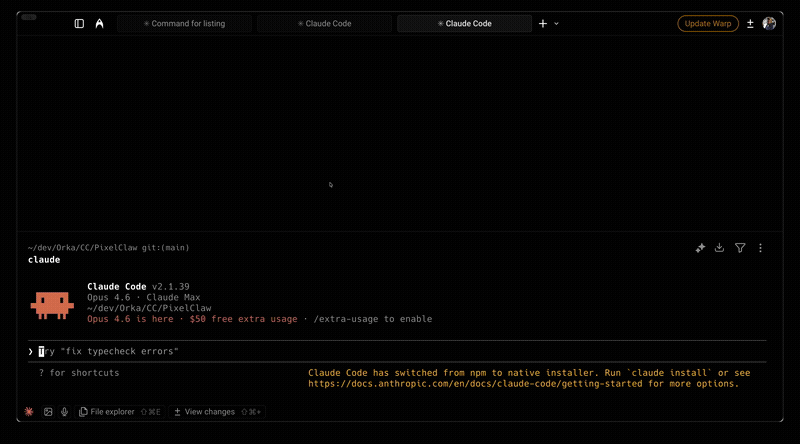

# ClaudeCode-Plugin

**[FR](README.fr.md)** | **[ES](README.es.md)** | **[DE](README.de.md)**

Ready-to-use plugins that make Claude Code actually useful in real projects. Memory, code review, dev workflow, safety guards — built from months of daily usage.

> Also, to track your external libraries, CVEs and more, check out [LibTracker](https://app.libtracker.io/).



## Getting Started

Follow the steps in order. Each one builds on the previous.

### Step 1: Configure Claude Code (first time only)

Install `cc-setup` and run the setup wizard. It asks about your workflow and generates a personalized `CLAUDE.md` — the file that tells Claude how YOU work.

```bash
claude plugin add github:joey-barbier/ClaudeCode-Plugin/plugins/cc-setup
```
Then type `/cc-setup:setup` and answer the questions.

### Step 2: Give Claude a memory

Install `cc-memory` so Claude remembers your project between sessions. No more re-explaining where you left off after a compact or a new conversation.

```bash
claude plugin add github:joey-barbier/ClaudeCode-Plugin/plugins/cc-memory
```

**What happens:** When you open Claude, it automatically detects your project files and restores full context — what's done, what's not, what to work on next. Type `/cc-memory:memory` to initialize memory on a new project or restore it manually.

### Step 3: Add the tools you need

Pick what fits your workflow. Each plugin works independently.

---

#### code-review — *Autonomous*

**Your personal Senior Tech Lead.** Activates automatically when you say "review PR" or when Claude detects code ready to push. Does a full first pass (architecture, security, quality) so when you review, you focus on what matters — not typos and misplaced ifs.

```bash
claude plugin add github:joey-barbier/ClaudeCode-Plugin/plugins/code-review
```

> Hook included (runs automatically, no command needed): Blocks push to main/master. Reminds you to review before pushing feature branches.

---

#### qa-testing — *Mixed (autonomous + command)*

**QA validation and test generation.** The QA agent activates automatically when you claim a feature is done — it challenges your assertions and tests edge cases. The test generator is a manual command.

```bash
claude plugin add github:joey-barbier/ClaudeCode-Plugin/plugins/qa-testing
```

| Component | How it works |
|---|---|
| QA validation agent | Autonomous — activates when validating features |
| Test generator | Command — type `/qa-testing:unit-test-expert` |

---

#### dev-workflow — *Commands + autonomous agent*

**Structured development methodology.** The agent activates for complex implementations. The skills are commands you type when needed.

```bash
claude plugin add github:joey-barbier/ClaudeCode-Plugin/plugins/dev-workflow
```

| Component | How it works |
|---|---|
| Dev methodology agent | Autonomous — activates for complex multi-layer work |
| `/dev-workflow:implement` | Command — launch a structured dev session |
| `/dev-workflow:new-feature` | Command — prepare git for a new feature |
| `/dev-workflow:time-check` | Command — detect over-engineering and loops |
| `/dev-workflow:init-docs` | Command — initialize project documentation |

> Hook included (runs automatically, no command needed): Blocks dangerous git commands (force push, hard reset, checkout ., restore ., clean, branch -D).

---

#### analytics — *Autonomous*

**SaaS analytics expert.** Activates when you work on tracking, funnels, or conversion. Designs what to measure, how to set it up, and what dashboards to build.

```bash
claude plugin add github:joey-barbier/ClaudeCode-Plugin/plugins/analytics
```

---

#### openclaw — *Commands*

**Session management for OpenClaw gateway.** Tools for long-running AI sessions — compress context, extract learnings, maintain performance.

```bash
claude plugin add github:joey-barbier/ClaudeCode-Plugin/plugins/openclaw
```

| Component | How it works |
|---|---|
| `/openclaw:compact` | Command — compress a large session |
| `/openclaw:extract` | Command — save learnings before cleanup |
| Shell scripts | `context-monitor.sh`, `context-guardian-daemon.sh`, `self-reboot.sh`, `clean-session-blobs.sh` |

> Hook included (runs automatically, no command needed): Warns you to save learnings before large sessions get compacted.

## How plugins work

Three types of components, three behaviors:

| Type | Behavior | Example |
|---|---|---|
| **Agents** | Autonomous — Claude activates them when relevant | Code review agent triggers on "review PR" |
| **Skills** | Commands — you type them when needed | `/cc-memory:memory` to restore context |
| **Hooks** | Silent — run in background, protect you from mistakes | Blocks `git push --force` automatically |

## Install the marketplace

To browse all plugins from Claude Code:

```bash
/plugin marketplace add github:joey-barbier/ClaudeCode-Plugin
```

Then use `/plugin` → **Discover** tab to browse and install.

## Questions?

I stream live on Twitch while building with Claude Code. Come ask questions, see the plugins in action, or suggest new ones.

**[twitch.tv/horka_tv](https://twitch.tv/horka_tv)**

## License

MIT — free to use, modify, and share.
