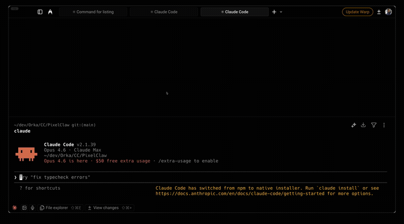

# ClaudeCode-Plugin

**[FR](README.fr.md)** | **[ES](README.es.md)** | **[DE](README.de.md)**

Ready-to-use Claude Code plugins: memory, code review, dev workflow, safety guards. Built from months of daily usage.

> Tracking external libraries, CVEs and more? Check out [LibTracker](https://app.libtracker.io/).



## Install

```bash
/plugin marketplace add joey-barbier/ClaudeCode-Plugin
```

Then `/plugin` → **Discover** tab to browse, or install plugins individually below.

## Plugin catalog

| Plugin | What it does | Components |
|---|---|---|
| **[horka-setup](#horka-setup)** | Personalized `CLAUDE.md` + architecture docs | 2 skills |
| **[horka-memory](#horka-memory)** | Persistent project memory across sessions | 1 skill |
| **[horka-review](#horka-review)** | Antagonist + Tech Lead code review | agent + 2 skills + hook |
| **[horka-qa-testing](#horka-qa-testing)** | QA validation + business unit tests | agent + skill |
| **[horka-dev-workflow](#horka-dev-workflow)** | Dev methodology + git safety | agent + 2 skills + hook |
| **[horka-analytics](#horka-analytics)** | SaaS tracking / funnel expert | agent |
| **[horka-openclaw](#horka-openclaw)** | Long AI session management | 2 skills + hook |
| **[horka-skill-eval](#horka-skill-eval)** | Skill quality auditor | skill |

---

## Getting Started

### 1. Configure Claude — `horka-setup`

```bash
claude plugin install horka-setup
```

- `/horka-setup:horka-claude-setup` — interactive questionnaire → personalized `CLAUDE.md`
- `/horka-setup:horka-init-docs` — generates architecture docs from your codebase (ARCHITECTURE, CONVENTIONS, WORKFLOW_PATTERNS...)

### 2. Give Claude a memory — `horka-memory`

```bash
claude plugin install horka-memory
```

Auto-restores project context at session start. `/horka-memory:horka-memory-restore` to initialize on a new project — scans your codebase and creates PROJECT_STATE, ARCHITECTURE, DECISIONS, NEXT_STEPS, COMMANDS files.

### 3. Pick tools below

Each plugin works standalone.

---

## horka-review

**Complete code review toolkit.** Two-pass review: antagonist finds flaws first, then Tech Lead validates.

```bash
claude plugin install horka-review
```

| Component | Trigger | Does |
|---|---|---|
| `/horka-review:antagonist-reviewer` | "roast", "critique", "find flaws" | Ruthless flaw finder — zero compliments, outputs BLOCKED/WARNINGS/WASTE |
| `/horka-review:horka-review-changes` | "review changes", "code review" | Senior Tech Lead structured review in isolated context |
| `review-pr` agent | "review PR" / pre-push | Architecture + security + quality pass |
| Review guard hook | auto | Blocks push to default branch, enforces review order on feature branches |

**Review order:** Antagonist (find flaws) → Fix → Tech Lead (validate) → Push/PR

---

## horka-qa-testing

**QA validation + business unit test generation.**

```bash
claude plugin install horka-qa-testing
```

| Component | Trigger | Does |
|---|---|---|
| `qa-validate` agent | "feature done" claims | Challenges assertions, tests edge cases |
| `/horka-qa-testing:horka-unit-test-generate` | command | Generates tests matching your conventions (permissions, limits, data consistency) |

---

## horka-dev-workflow

**Structured dev methodology + git safety.**

```bash
claude plugin install horka-dev-workflow
```

| Component | Trigger | Does |
|---|---|---|
| `dev-methodology` agent | complex implementations | Coordinates multi-layer changes in dependency order |
| `/horka-dev-workflow:horka-git-new-feature` | command | Preps git: main → pull → delete merged → new `feature/` branch |
| `/horka-dev-workflow:horka-mvp-time-guardian` | command | Detects loops, proposes fastest working solution |
| Git safety hook | auto | Blocks force push, hard reset, checkout ., clean, branch -D |

---

## horka-analytics

**SaaS analytics expert.** Auto-activates on tracking / funnel / conversion topics. Designs what to measure, implementation, and dashboards.

```bash
claude plugin install horka-analytics
```

---

## horka-openclaw

**Long AI session management.**

```bash
claude plugin install horka-openclaw
```

| Component | Trigger | Does |
|---|---|---|
| `/horka-openclaw:horka-openclaw-session-compact` | command | Compresses sessions >20MB, extracts decisions/configs, archives original |
| `/horka-openclaw:horka-openclaw-session-extract` | command | Extracts learnings to memory files |
| Session hook | auto | Warns before heavy session compaction |

Shell tools: `context-monitor.sh`, `context-guardian-daemon.sh`, `self-reboot.sh`, `clean-session-blobs.sh`.

---

## horka-skill-eval

**Skill quality auditor** against Anthropic's official best practices.

```bash
claude plugin install horka-skill-eval
```

| Component | Trigger | Does |
|---|---|---|
| `/horka-skill-eval:horka-skill-evaluate` | command | Scores 5 categories /100, proposes fixes, re-evaluates before/after |

---

## How plugins work

| Type | Behavior | Example |
|---|---|---|
| **Agents** | Autonomous — Claude activates when relevant | `review-pr` on "review PR" |
| **Skills** | Commands you type | `/horka-memory:horka-memory-restore` |
| **Hooks** | Silent background guards | Blocks `git push --force` |

## Questions?

Live on Twitch building with Claude Code. Ask questions, watch plugins in action, or suggest new ones.

**[twitch.tv/horka_tv](https://twitch.tv/horka_tv)**

## License

MIT — free to use, modify, and share.
